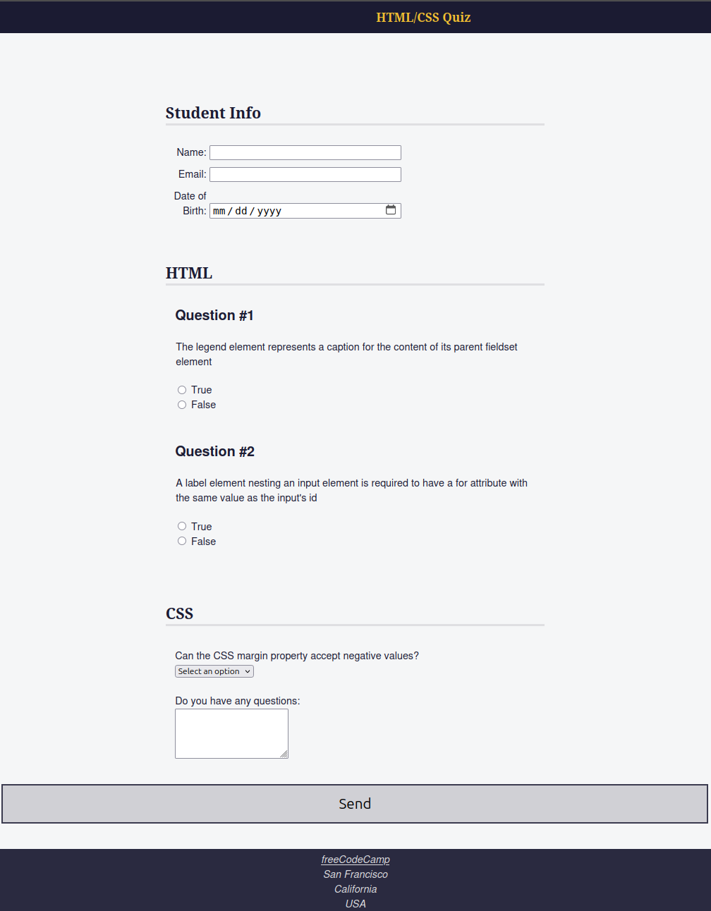

# 🧠 Accessibility Quiz — HTML/CSS Project



## 📋 Overview

This project is a responsive, accessible quiz built using semantic HTML and modern CSS. It is based on a **freeCodeCamp practice challenge** for accessibility, extended with a personal touch to highlight understanding of HTML structure, accessibility principles (ARIA, labels, keyboard navigation), and form usability.

## 🚀 Features

- 🧩 **3 Quiz Sections**:
  - Student Information
  - HTML Questions
  - CSS Questions

- 🦽 **Accessibility**:
  - Uses semantic HTML elements like `<header>`, `<nav>`, `<main>`, `<section>`, `<fieldset>`, `<legend>`, and `<address>`
  - Implemented ARIA attributes such as `role="region"` and `aria-labelledby`
  - Ensures form elements have proper `label` associations via `for` and `id`
  - Adds a screen-reader-only class `.sr-only` for improved screen reader navigation
  - Focus styles and visual grouping enhance keyboard navigation

- 📱 **Responsive Design**:
  - Layout adjusts to different screen sizes using `@media` queries and flexible units like `vw`, `max()`, and `min()`
  - Cards and form rows adapt for mobile-friendly viewing

- 🎨 **Clean UI**:
  - Header and footer with branding
  - Highlighted nav on hover
  - Button-centered submission UX

## 📁 File Structure

```plaintext
accessibility-in-html-webpage-quiz/
├── index.html              # Main HTML document
├── styles.css              # Styling for layout and accessibility
├── images/
│   └── preview.png         # Project screenshot
├── .gitignore              # Standard Git ignore file
├── LICENSE                 # MIT License
└── README.md               # Project documentation
```

## 🧑‍💻 Accessibility Highlights
| Feature                      | Implementation                                                                  |
| ---------------------------- | ------------------------------------------------------------------------------- |
| ARIA Labels                  | `<section role="region" aria-labelledby="id">` used to define logical regions   |
| Semantic Form Structure      | `<fieldset>`, `<legend>`, `<label for="">` ensure screen reader compatibility   |
| Keyboard-Friendly Navigation | All inputs and controls are focusable and logically ordered                     |
| Screen Reader Support        | `.sr-only` class hides text visually but keeps it accessible for screen readers |
| Color Contrast & Visual Cues | Strong contrast in header/footer, hover effects on nav links                    |

## 💡 Major Takeaways
- How to use ARIA roles and labels for assistive technology

- Importance of associating labels correctly with form inputs

- The difference between `inline`, `inline-block`, and `block` for layout behavior

- Responsive styling using `max-width`, `vw`, and `media queries`

- How accessibility and design go hand-in-hand

## 🛠 Tech Stack
- HTML5

- CSS3

- No JavaScript — fully functional with native HTML/CSS

## 🧪 Future Improvements
- Add JavaScript form validation for additional UX improvement

- Integrate progress tracking across questions

- Animate transitions with respect to `prefers-reduced-motion` media query

## 📜 License
This project is licensed under the MIT License. See the LICENSE file for details.

### Made with ❤️ and a commitment to accessibility.

